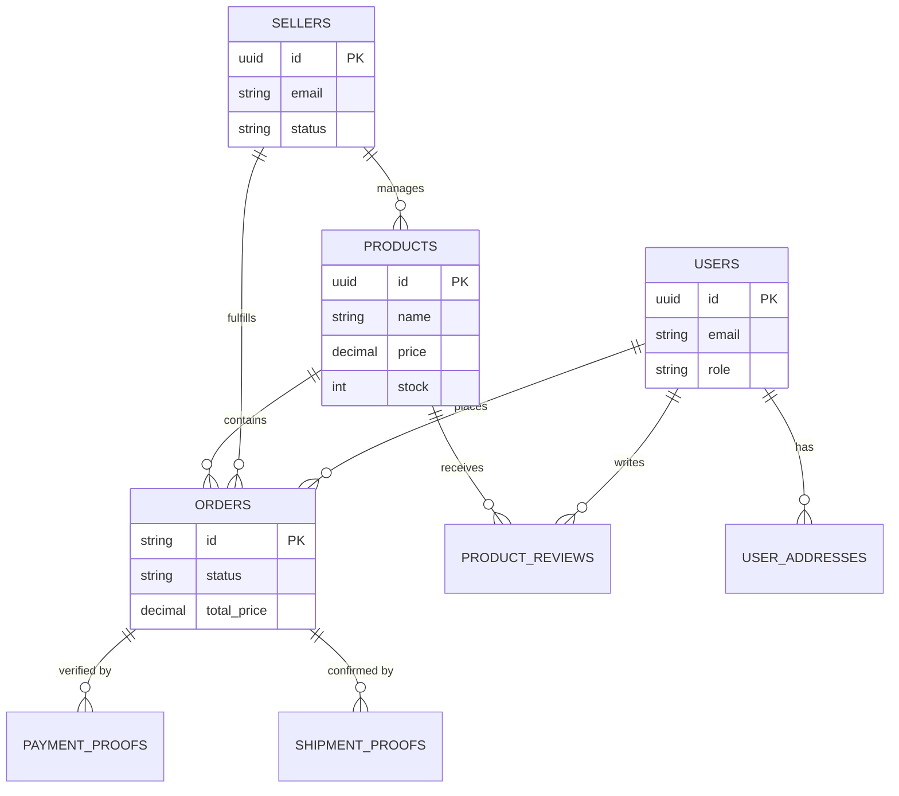

# KKM Application Comprehensive Design Document

## 1. Executive Summary
The **KKM (Komunitas Kampung Main)** application is a hybrid platform serving a community-based marketplace and event management system. It bridges modern web technologies with legacy operations (Google Sheets) to provide a seamless experience for users (Buyers/Participants) and organizers. The system is designed to be "Scalable & Free" by leveraging serverless databases and existing Google Workspace tools.

---

## 2. System Architecture

### 2.1 High-Level Architecture
The system follows a Client-Server architecture with a specialized "Dual-Write" strategy for data persistence.

*   **Frontend (Client)**: A React-based Single Page Application (SPA) providing the user interface for mobile and desktop.
*   **Backend (Server)**: A Node.js/Express server acting as the central controller, managing authentication, business logic, and third-party integrations.
*   **Database (Primary)**: **Neon (PostgreSQL)** serves as the scalable, relational source of truth for critical data (Users, Sellers, Products, Orders, Reviews).
*   **Data Sync (Secondary/Admin)**: **Google Sheets** acts as an operational dashboard for non-technical admins and a backup data source.
*   **File Storage**:
    *   **Google Drive**: Stores generated PDF tickets and some uploaded proofs.
    *   **Database (Blob)**: Stores shipment and payment verification images directly (base64/buffer) for immediate access.
*   **AI Service**: **Google Gemini (via AI Studio)** powers the intelligent chatbot "Annisa" for Q&A and routing.
*   **Logistics**: **Komerce/RajaOngkir** integration for shipping cost calculations and location lookups.

### 2.2 Tech Stack
| Component | Technology | Purpose |
| :--- | :--- | :--- |
| **Frontend** | React, Vite, TailwindCSS, Framer Motion | Dynamic UI, Mobile-first design. |
| **Backend** | Node.js, Express, TypeScript | REST API, Business Logic. |
| **Database** | PostgreSQL (Neon), Drizzle ORM | Relational Data, Schema Management. |
| **Auth** | Passport.js (Google OAuth2) | Secure User & Seller Authentication. |
| **Integrations** | Google Sheets API, Drive API, Gmail API | Admin Ops & Notifications. |
| **AI** | Google Generative AI SDK | Chatbot & Intent Recognition. |

### 2.3 System Diagram
```mermaid
graph TD
    Client[Client App (React)] <-->|REST API| Server[Node/Express Server]
    
    subgraph Backend Services
        Server <-->|Auth| Passport[Passport.js / Google OAuth]
        Server <-->|Query/Write| DB[(Neon Postgres)]
        Server <-->|Chat Context| AI[Google Gemini AI]
        Server <-->|Shipping Cost| Logistics[Komerce/RajaOngkir]
    end
    
    subgraph Google Workspace Ecosystem
        Server -.->|Dual Write (Orders)| Sheets[Google Sheets]
        Server -.->|Upload Tickets| Drive[Google Drive]
        Server -.->|Send Emails| Gmail[Gmail / Nodemailer]
    end
```

---

## 3. Database Schema (Neon PostgreSQL)

The database, managed via Drizzle ORM, consists of the following core entities:

### 3.1 Core Users & Auth
*   **`users`**: The central identity table for app users.
    *   `id` (UUID, PK), `email`, `google_id`, `full_name`, `role` (user/admin).
    *   *Usage*: Authentication, linking bookings and reviews.
*   **`session`**: Stores Express sessions (connect-pg-simple) for persistent login.
*   **`user_addresses`**: Stores shipping addresses for users.
    *   `user_id` (FK), `province_id`, `city_id`, `subdistrict_id`, `full_address`.

### 3.2 Marketplace Ecosystem
*   **`sellers`**: Registered sellers in the platform.
    *   `id` (UUID, PK), `email` (Unique), `seller_id` (Legacy ID), `status` (active/suspended).
    *   *Relation*: Owns Products.
*   **`products`**: Items listed for sale.
    *   `id` (UUID, PK), `sellerId` (FK), `name`, `price`, `stock`, `images` (JSON Array).
    *   *Data Flow*: Synced from App -> DB -> Google Sheet.
*   **`orders`**: Transaction records (Single Source of Truth).
    *   `id` (Varchar, PK), `userId` (FK), `sellerId` (FK), `productId` (FK).
    *   `status` (enum: pending, paid, shipped, completed), `paymentProofUrl`.
*   **`product_reviews`**: User feedback on products.
    *   `id` (UUID), `productId` (FK), `userId` (FK), `rating` (1-5), `comment`.
    *   *Logic*: Allows 1 review per order (via `orderId` link).
*   **`shipment_proofs`** & **`payment_proofs`**:
    *   Stores binary image data (`file_data`) and metadata for proofs. linked to `orders`.

### 3.3 Access Control
### 3.4 Entity Relationship Diagram (ERD)


---

## 4. Component Architecture & Code Groups

### 4.1 Project Context & File Structure
```text
/server
  /src
    /db         # Database Configuration & Schema
      - schema.ts (Definition of all tables)
    /routes     # API Route Handlers
      - index.ts (Main Router)
      - reviewRoutes.ts (Reviews Logic)
      - sellerRoutes.ts (Seller Dashboard Logic)
      - productRoutes.ts (Product Mgmt & Sheet Sync)
      - chat.ts (AI Endpoint)
    /services   # Business Logic & External APIs
      - aiService.ts (Gemini Integration)
      - googleSheets.ts (Sheet Sync Logic)
      - komerceService.ts (Shipping Calculator)
    /middleware # Auth & Validation
      - auth.ts (User Passport Strategy)
      - sellerAuth.ts (Seller JWT Strategy)
  /scripts      # Maintenance & Migration
      - migrate_orders.ts (One-off data moves)

/client
  /src
    /pages      # Application Views
      - MarketplacePage.tsx (Shopping)
      - MyOrdersPage.tsx (User Dashboard)
    /components # Reusable UI
```

### 4.2 Backend (`server/src`)

#### **A. Routes (API Layer)**
Entry points for frontend requests.
*   **`index.ts` (Main App)**:
    *   Mounts all middleware (CORS, Sessions, Passport).
    *   **Core Endpoints**: `POST /api/order` (Order Creation), `GET /api/my-market-orders` (History).
    *   **Legacy/Misc**: `api/shipping/cost` (Komerce proxy), `api/locations/*`.
*   **`routes/productRoutes.ts`**: CRUD for Products.
    *   *Usage*: Seller creates/edits items. Triggers sync to Google Sheets.
*   **`routes/sellerRoutes.ts`**: Seller Dashboard operations.
    *   *Usage*: `GET /orders`, `POST /ship` (Uploads proof, updates DB status).
*   **`routes/reviewRoutes.ts`**: Rating system.
    *   *Usage*: `POST /` (Submit review), `GET /product/:id` (List reviews).
*   **`routes/chat.ts`**: AI Interface.
    *   *Usage*: `POST /` (User sends message -> Gemini processes -> Returns Text/Action).
*   **`routes/publicRoutes.ts`**: Public data access.
    *   *Usage*: `GET /marketplace-items` (Read-only feed for non-logged users).

#### **B. Services (Business Logic)**
Encapsulated logic/integrations.
*   **`googleSheets.ts`**: Handles reading/writing to the implementation Google Sheet.
    *   *Functions*: `getMarketplaceOrders()`, `updateMarketplaceOrder()`, `addMarketplaceItem()`.
*   **`aiService.ts`**: Manages Google Gemini interactions.
    *   *Functions*: `chat()` (Main conversational loop with tool calling).
*   **`emailService.ts`**: Sends transactional emails (Order confirmation, Shipping alerts).
*   **`komerceService.ts`**: Proxies requests to Komerce/Komship API for logic.

#### **C. Database Layer (`db/`)**
*   **`schema.ts`**: Drizzle ORM definitions (Source of Truth for DB Structure).
*   **`index.ts`**: Connection pool initialization.

### 4.2 Frontend (`client/src`)

#### **A. Pages (Views)**
*   **`MarketplacePage.tsx`**: The main shopping hub.
    *   *Features*: Product Grid, Search, Categories, Product Detail Modal (with Reviews & AI Summary).
*   **`MyOrdersPage.tsx`**: User Dashboard.
    *   *Features*: List orders (Tabbed: Market/Event), Payment Actions, "Rate Item" flow.
*   **`SellerDashboard.tsx`**: Secure area for Sellers.
    *   *Features*: Incoming Orders, Ship Items (Upload Resi/Proof), Manage Products.
*   **`MorePage.tsx`**: Utility hub.
    *   *Features*: AI Chat entry point, settings, extra info.

#### **B. Components**
*   **`ChatWidget.tsx`**: Global floating AI assistant.
*   **`ProductCard.tsx`**: Reusable display for items.

---

## 5. Data Flows & User Journeys

### 5.1 Marketplace Order Flow (The "Hybrid" Journey)
1.  **Discovery**: User views `MarketplacePage`, fetches products from **Neon DB**.
2.  **Order**: User clicks "Buy" -> `POST /api/order`.
    *   **Backend**: 
        1.  Resolves Product & Seller IDs from **Neon**.
        2.  **Write 1 (Primary)**: Inserts record into `orders` table (Status: Pending).
        3.  **Write 2 (Backup)**: Appends row to "Market OB" in **Google Sheets**.
        4.  **Notify**: Sends email to Seller.
3.  **Payment**: User uploads proof -> `POST /upload-proof`.
    *   Updates `orders` status to 'paid'.
    *   Stores image in `payment_proofs` table.
4.  **Fulfillment**: Seller sees order in `SellerDashboard`.
    *   Click "Ship" -> Inputs Resi -> `POST /ship`.
    *   Updates `orders` status to 'shipped'.
5.  **Completion**: User receives item -> Click "Confirm Receipt".
    *   Updates `orders` status to 'completed'.
6.  **Review**: User clicks "Rate Item" -> `POST /api/reviews`.
    *   Inserts into `product_reviews`.

### 5.2 Event Booking Flow
1.  **Booking**: User fills form for Event.
2.  **Processing**: Server appends to "Bookings" Sheet.
3.  **Ticket**: Server generates PDF -> Uploads to **Google Drive**.
4.  **Delivery**: Link sent to User via WhatsApp/Email.

### 5.3 AI Chat Interaction
1.  **User**: Asks "How do I sell?"
2.  **Backend**: `chat.ts` receives message.
3.  **AI**: Analyzes intent -> enhancing "Persona" (Annisa).
4.  **Response**: "To sell, please register via..." (Text) or Action (Open WhatsApp).

---
